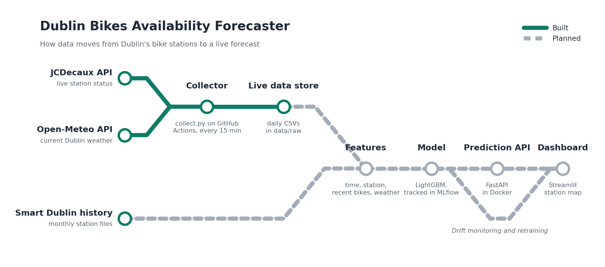

# 🚲 Dublin Bikes Availability Forecaster

**Predicting how many bikes a Dublin Bikes station will have in the next 30–60 minutes, using live data that is collected automatically every 15 minutes.**

> 🚧 **Work in progress.** The live data pipeline and exploratory analysis are complete. Modelling, the prediction API and the dashboard are in development (see [Roadmap](#roadmap)).

---

## The problem

Dublin Bikes has 115 stations across the city, but some of them are empty for a large share of the day. In June 2026, **Parnell Square North had zero bikes 47% of the time**, so a rider arriving there had close to a coin-flip chance of finding no bike.

Live apps show how many bikes a station has *right now*. This project aims to predict how many it will have *by the time you get there*.

## What it does so far

- **Automated data collection:** a GitHub Actions workflow calls the JCDecaux Dublin Bikes API and the Open-Meteo weather API every 15 minutes, and commits each snapshot to this repo. It runs around the clock with no server or laptop needed.
- **Exploratory analysis:** a month of historical station data (606,510 readings from 115 stations, June 2026) cleaned and analysed to find the patterns a model needs to learn.

## Key findings

### 1. The weekday commute drives the whole network


On weekdays, average station fill drops sharply at **8 a.m.** and again at **5 p.m.**, when thousands of bikes are out on the road. Weekends stay almost flat, with only a mild midday dip. The same station at the same hour behaves very differently on a Tuesday than on a Sunday, so **hour of day and weekday/weekend are essential features**.

### 2. Stations differ in how reliably they recover


I expected northside residential stations and southside office stations to run empty at opposite times. The data only partly supported this:

- **Fitzwilliam Square East** (office area) fills almost completely every morning: it is empty under 10% of the time from 9 a.m. to 4 p.m., then empties quickly after 5 p.m.
- **Parnell Square North** is already empty 60–75% of the time at midnight, and only partially recovers during the day, in a much less predictable way.

Both stations are mostly empty at night. The real difference is how reliably they refill. Because each station has its own rhythm, **station identity needs to be a model feature**.

### 3. "Same as now" will be a strong baseline

A station that is empty at 1 a.m. is almost always still empty at 1:30 a.m. Predicting "no change" will therefore score well overall, especially at night. The model will be **evaluated hour by hour**, with a focus on rush hours (7–9 a.m. and 4–7 p.m.), when stations change fastest and simple guesses fail.

## Architecture



Green lines show components that are built and running; grey dashed lines show planned components.


## Project structure

```
dublin-bikes-forecast/
├── .github/workflows/
│   └── collect.yml        # scheduled data collection (every 15 min)
├── data/
│   ├── raw/               # live snapshots collected by the workflow
│   └── historical/        # monthly history files (downloaded locally, not committed)
├── images/                # charts used in this README
├── notebooks/
│   └── 01_explore.ipynb   # exploratory data analysis
├── src/
│   └── collect.py         # fetches station status + weather, appends to CSV
├── requirements.txt
└── README.md
```

## Running it yourself

**Requirements:** Python 3.10+ and a free [JCDecaux API key](https://developer.jcdecaux.com/#/opendata/vls?page=getstarted).

```bash
git clone https://github.com/X2RSaM/dublin-bikes-forecast.git
cd dublin-bikes-forecast
python3 -m venv .venv
source .venv/bin/activate
pip install -r requirements.txt

export JCDECAUX_API_KEY=your_key_here
python src/collect.py
```

To run the automated collection on your own fork, add your key as a repository secret named `JCDECAUX_API_KEY` (Settings → Secrets and variables → Actions) and set workflow permissions to "Read and write".

## Roadmap

- [x] Automated live data collection with GitHub Actions
- [x] Exploratory analysis of historical data
- [ ] Download and combine 12 months of history
- [ ] Baselines: "same as now" and historical average by station, weekday and hour
- [ ] LightGBM forecasting model with experiment tracking (MLflow)
- [ ] Hour-by-hour evaluation, focused on rush hours
- [ ] Prediction API (FastAPI + Docker)
- [ ] Interactive map dashboard (Streamlit), deployed online
- [ ] Data drift monitoring and automated retraining

## Data sources

- **Dublin Bikes station data:** Dublin City Council, via [Smart Dublin / data.gov.ie](https://data.gov.ie/en_GB/dataset/dublinbikes-api), licensed under [CC BY 4.0](https://creativecommons.org/licenses/by/4.0/). Live data from the [JCDecaux open data API](https://developer.jcdecaux.com/).
- **Weather data:** [Open-Meteo](https://open-meteo.com/), licensed under [CC BY 4.0](https://creativecommons.org/licenses/by/4.0/).

## Author

**Sourav Arun Mahajan**, MSc in Artificial Intelligence student, National College of Ireland, Dublin.
GitHub: [@X2RSaM](https://github.com/X2RSaM)